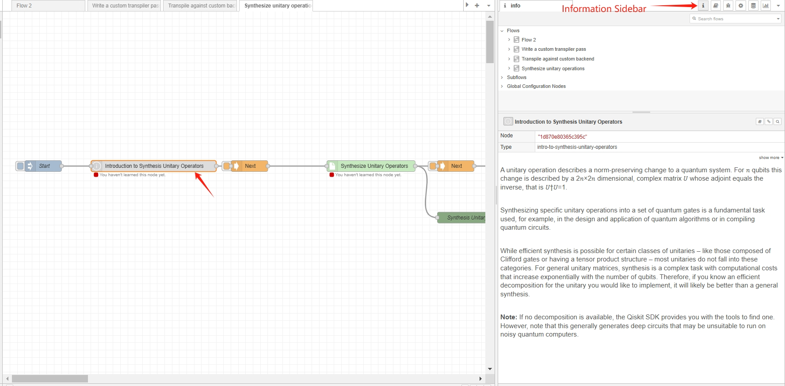
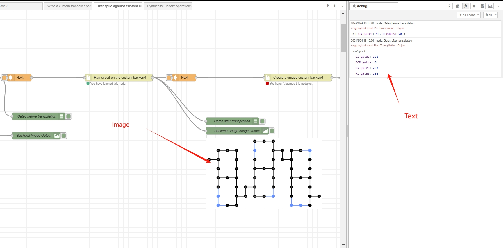
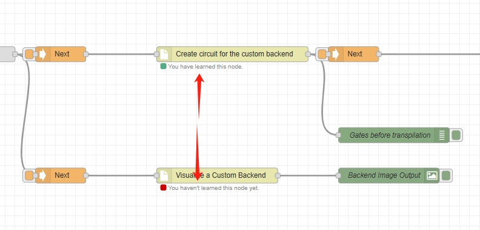
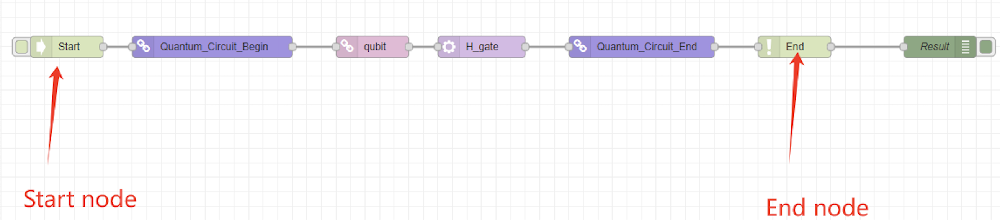
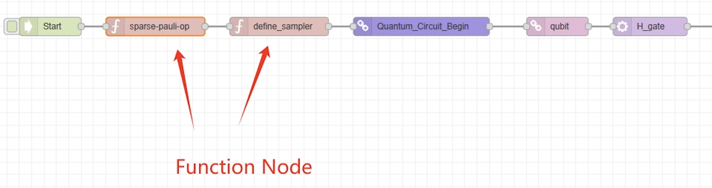
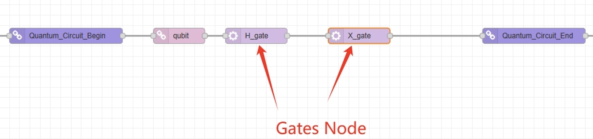
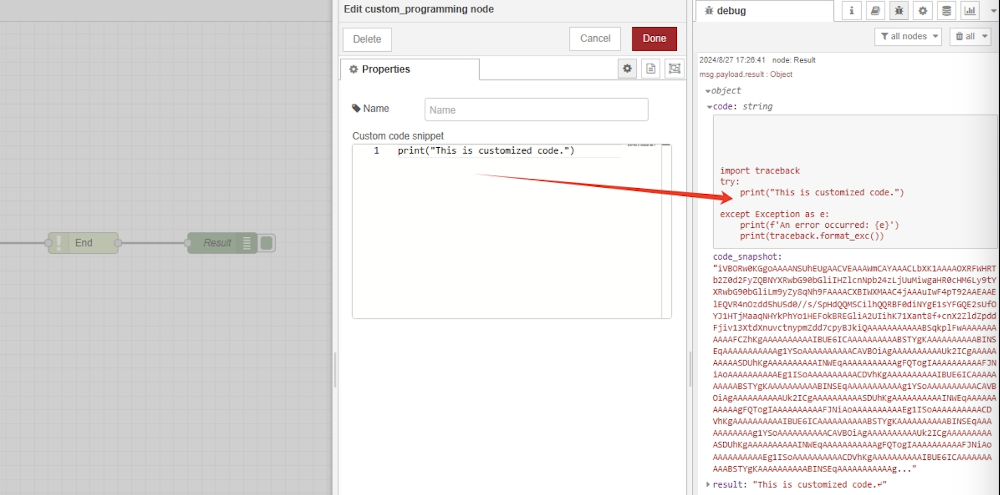
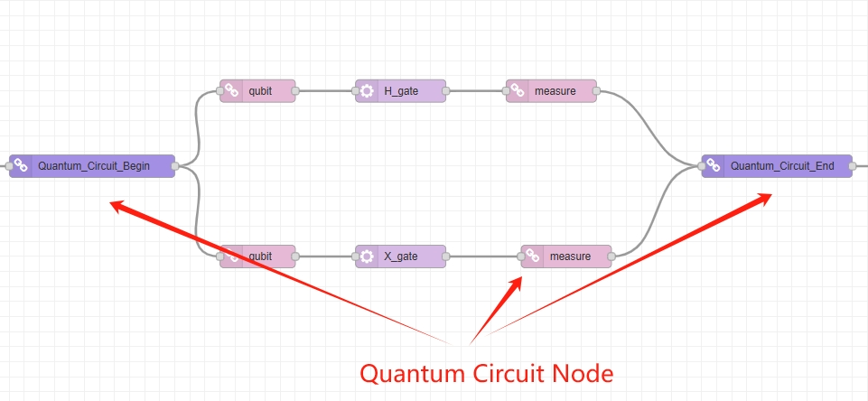
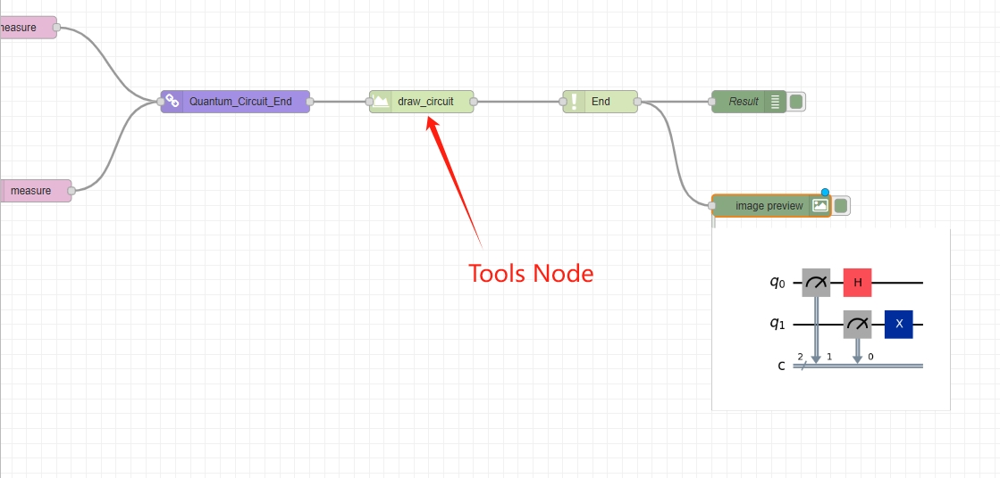

# Node-RED Qiskit functionality
Our objective is to create a Node-RED-based learning and interactive platform, supported by IBM's Qiskit, to make quantum computing more accessible. Qiskit, a powerful quantum computing library, has a steep learning curve. To address this, we use Node-RED's visual interface to simplify quantum programming by breaking down complex concepts into manageable components. Our project abstracts core Qiskit functionalities into Node-RED nodes, each representing a fundamental quantum operation, helping software developers with little or no knowledge of quantum physics effectively use the Qiskit library.

Firstly, we transform complex Qiskit documentation into easy-to-follow, graphical Node-RED flows with detailed explanations and code snippets. Additionally, we designed the Interactive Node Framework, allowing users to design quantum circuits and algorithms through a user-friendly graphical interface, eliminating the need for coding. This hands-on approach not only simplifies quantum computing but also fosters a deeper understanding of quantum concepts, making the field more approachable and inclusive. Ultimately, this package encourages critical thinking and experimentation with quantum algorithms, enhancing users' comprehension of quantum computing.
## Prerequisites
- Node.js v21.0.0
- Node-RED v3.1.9
- Python3
## Installation
1. Install Node-RED: https://nodered.org/docs/getting-started/local
2. In your node-red user directory, typically `~/.node-red`, install this package:
   - npm install node-red-qiskit-functionality
3. Once installed these you can use the `node-red` command to start Node-RED in your terminal, and check whether our nodes are in your palette.
## How to Use
### Qiskit Learning flow
The Qiskit Learning Flow integrates Qiskit documents into the more graphical step-by-step prebuilt Node-RED flows. It consists of a series of pre-built flows. To begin, you need to import the desired learning content from `./Learning/flows` into your Node-RED workspace and deploy it. Once deployed, you can follow these steps to explore and learn from the content in the flow:

1. Click the button on the _Start_ node to execute this flow.

2. Select the connected node and review the information in the sidebar. The information sidebar includes details on the quantum knowledge related to the node, code snippets, explanations of those code snippets, and information about Node input and output.

1. After completing the current node, click on the _Next_ node and use the Information sidebar to learn about the connected node. Continue this process for each subsequent node.

2. After clicking the _Start_ or _Next_ node, if any connected nodes contain code snippets, these snippets will be executed. The results will either be displayed as images in the workspace or as text in the debug sidebar, helping users to better understand the code. (Tips: Some nodes require input parameters to execute their code. Please remember to open the _Edit palette_ to check if any parameters need to be entered)

1. After you complete learning the content of a node, its status will change from red to green, indicating that you have studied the material in that node. This allows you to track your learning progress.

1. Once completing your study, you can revisit the flow by re-importing and redeploying it for further learning.

### Interactive Node Framework
The Interactive Node Framework simplifies quantum computing by allowing users to design circuits and develop algorithms through a user-friendly graphical interface, eliminating the need for coding. The nodes in the Interactive Node Framework are categorized as follows:
1. **Flow**

    The purpose of the Flow category is to define the scope of the entire flow. The _Start_ node should be placed at the beginning of the flow, while the _End_ node should be positioned at the end of the flow. The output generated by the _End_ node includes the following components:
    - `msg.payload.result.code`: The final code snippet in text format.
    - `msg.payload.result.code_snapshot`: The final code snippet in image format.
    - `msg.payload.result.result`: The execution result of the final code snippet.
    After the _End_ node, only the _debug_ node or the _image output_ node can be used to display the results.
    

- **Functions**

    The Functions category includes various functional nodes, such as those for defining a sampler for a quantum circuit or converting results into readable output. Each node has a distinct responsibility, and you can use these nodes according to your needs. Note that these responsibilities do not involve operations at the qubit level, so function nodes should always be placed outside the quantum circuit you defined.
    

- **Gates**

    The Gates category includes various gates that can be applied to qubits, such as the Hadamard gate and the NOT gate. These gates can be arranged and combined in any order, but they must be placed after the _qubit_ node.
    
    

- **Math**

    The Math category includes operations related to mathematics, which are used to support the construction of quantum computing at a mathematical level. For example, it can receive an Adjacency Matrix representing a graph in JSON format.

- **Programming**

    The purpose of the Programming node is to enhance the flexibility and scalability of the framework. It includes a text input box where users can manually enter Python code snippets and insert this node at any location in the flow to customize the final generated code.
    

- **Quantum Circuit**

    The QuantumCircuit class is used to define and construct quantum circuits, and it also includes some fundamental operations for quantum circuits. The _Quantum-Circuit-Begin_ and _Quantum-Circuit-End_ nodes define the scope of the quantum circuit. Users should start with the _Quantum-Circuit-Begin_ node and follow it with the desired number of _qubit_ nodes. After adding operation nodes such as _Gate_ and _Measure_ to the _qubit_ nodes, the circuit should be ended with the _Quantum-Circuit-End_ node.
    

- **Tools**

    The Tools category includes various useful functions, such as _draw circuit_ and _print_, that assist in constructing and outputting flows more conveniently.
    

## Contributing
## Acknowledgements
For more information about the authors, please refer to the [AUTHORS](./AUTHORS) file.

This Node-RED library was created as part of a partnership between [UCL IXN](https://www.ucl.ac.uk/computer-science/collaborate/ucl-industry-exchange-network-ucl-ixn) and [IBM](https://www.ibm.com/uk-en). IBM defined and arranged the project, which was assigned to students from UCL's Computer Science Department as part of their Master's thesis.  Special thanks go to John McNamara for managing the project's development, David Clark for serving as Academic Supervisors, and Roberto LoNardo for serving as our Quantum Mento advisors and guides.
